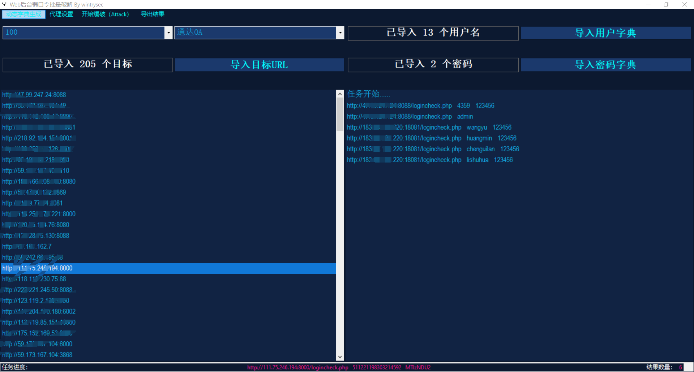
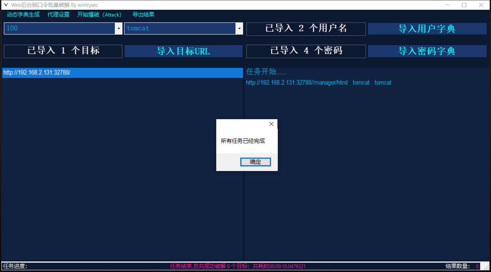
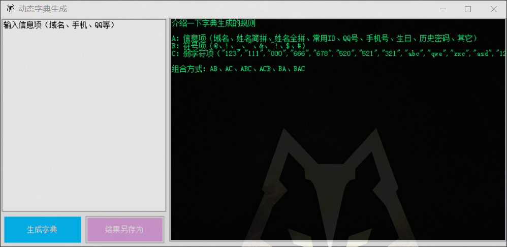
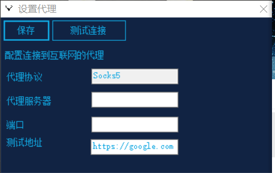

# WebBrute
> 用于批量破解没有验证码的Web登陆页面
>
> URL格式必须自己带上`http://`或`https://`

**推荐使用场景：**

（1）Tomcat HTTP-basic认证

（2）通达OA使用123456和空口令爆破用户名

（3）致远OA使用123456等爆破用户名

（4）弱口令进去之后可以收集更多目标人员信息，或者特定版本可上传shell

附带一个社工字典生成工具

可以配合SSR使用代理连接目标（但是会因网络原因拖慢速度）

